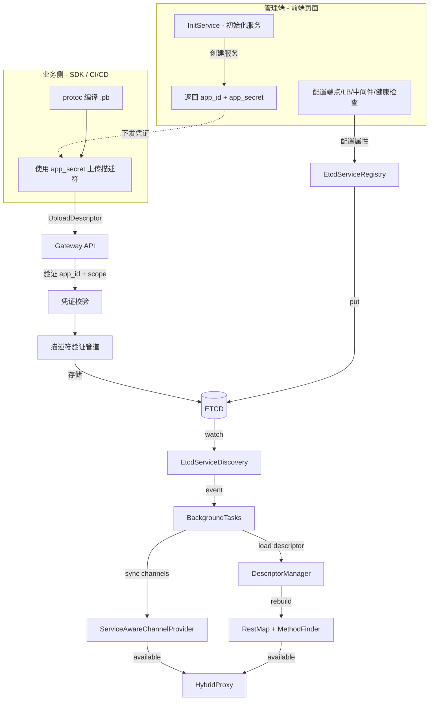
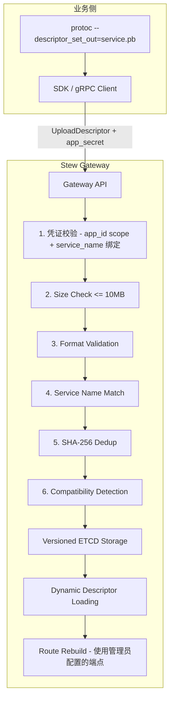

# 服务发现与热加载

> 返回 [README](README.md) | 参阅 [项目架构](项目架构.md)

---

## 概述

Stew 通过 ETCD 实现服务注册、发现与描述符传播。系统采用 **管理端优先** 模型：

1. 管理员在前端管理页面 "初始化服务"，获取 `app_id` / `app_secret` 凭证
2. 管理员在前端配置端点、负载均衡、中间件、健康检查等属性
3. 业务侧使用 `app_secret` 上传编译好的 `.pb` 描述符文件
4. 网关自动加载描述符、重建路由表，秒级生效，无需重启

```
管理员（前端页面）               业务侧（SDK / CI/CD）
     |                                |
  InitService                   UploadDescriptor
  (创建服务)                    (上传 .pb 描述符)
     |                                |
     v                                v
  返回 app_id               使用 app_secret 认证
  + app_secret                        |
     |                                v
  配置端点/LB/中间件            网关加载描述符 + 重建路由
```

> **权限分离原则**：服务的基础设施配置（端点、负载均衡、中间件策略）由管理员通过前端页面操作；
> 业务侧仅能上传/回滚描述符文件和可选发送心跳，不能修改服务配置或删除服务本身。

---

## 核心组件

| 组件 | 源码 | 功能 |
|------|------|------|
| `EtcdServiceRegistry` | `src/core/service_discovery.rs` | 服务注册到 ETCD（含租约和 keepalive） |
| `EtcdServiceDiscovery` | `src/core/service_discovery.rs` | Watch ETCD 变更，维护本地缓存与广播 |
| `ServiceDiscoveryServiceImpl` | `src/discovery/service.rs` | gRPC 服务发现接口实现 |
| `BackgroundTaskManager` | `src/app/background_tasks.rs` | 后台异步任务管理 |
| `ServiceDiscoveryMonitor` | `src/discovery/monitoring.rs` | ETCD Watch 监控循环 |
| `DescriptorManager` | `src/core/descriptor_manager.rs` | 描述符动态加载管理 |
| `DistributedRouteRegistry` | `src/core/distributed_route_registry.rs` | 分布式路由冲突检测 |

---

## 数据流

### 服务注册与描述符加载



### 描述符自动提交流程



---

## 服务注册

### ETCD 键结构

```
/services/{service_name}/{instance_id}
```

每个键的值为二进制 Protobuf 编码的 `ServiceInstance`。

### ServiceInstance 结构

```protobuf
message ServiceInstance {
  string instance_id = 1;
  string service_name = 2;
  string host = 3;
  int32 port = 4;
  BalanceType lb = 5;
  int32 weight = 6;
  bytes protobuf_descriptor = 7;    // FileDescriptorSet (可选)
  string health_check = 8;          // 健康检查方法 (可选)
  map<string, string> metadata = 9;
}
```

### 注册流程

1. 管理员通过前端 "初始化服务" 创建 `ServiceInstance`（状态为 MAINTENANCE，无端点）
2. 管理员在前端配置端点、负载均衡、中间件等属性
3. 同一 `service_name` 共享租约（TTL 默认 300s）
4. `lease_id` 通过 `service_name` 稳定派生（哈希），保证幂等
5. 启动 keepalive 协程（15s 周期，带失败退避与上限）
6. 写入 ETCD（PUT with lease）

### 初始化方式（管理端）

通过前端管理页面 "初始化服务" 操作，或管理员直接调用 API：

```bash
# 管理员调用初始化接口
curl -X POST http://localhost:3012/api/v1/discovery/services/init \
  -H "Authorization: Bearer $ADMIN_TOKEN" \
  -H "Content-Type: application/json" \
  -d '{
    "service_name": "your.service.v1.OrderService",
    "description": "Order management service",
    "protocol": "grpc"
  }'

# 返回 app_id + app_secret（仅显示一次）
# {
#   "success": true,
#   "app_id": "key_abc123",
#   "app_secret": "ak_xxxxxxxxxxxxxxxxxxxxxxxxxxxxxxxx",
#   "service_name": "your.service.v1.OrderService"
# }
```

### 描述符上传方式（业务侧）

业务侧使用管理员下发的 `app_secret` 上传描述符：

```bash
# 先编译 proto 为 FileDescriptorSet
protoc --descriptor_set_out=service.pb --include_imports service.proto

# 使用 app_secret 上传描述符
grpcurl -plaintext \
  -H "x-api-key: $APP_SECRET" \
  -d "{
    \"service_name\": \"your.service.v1.OrderService\",
    \"descriptor_data\": \"$(base64 -w0 service.pb)\",
    \"descriptor_version\": \"v1.0.0\"
  }" \
  localhost:3012 stew.api.v1.ServiceDiscoveryService/UploadProtobufDescriptor
```

> 上传描述符后，网关会自动执行验证管道（大小检查、格式验证、服务名匹配、去重、兼容性检测），
> 通过后进行版本化存储并动态加载路由，使用管理员已配置的端点。

---

## 服务发现

### Watch 机制

`EtcdServiceDiscovery` 持续 watch `/services/` 前缀：

- **PUT 事件**：新服务注册或更新，解码 `ServiceInstance`，更新本地缓存
- **DELETE 事件**：服务注销或租约过期，从缓存中移除
- 通过 `watch::Receiver` 广播变更通知

### 后台响应流程

`BackgroundTaskManager` 收到变更后执行：

1. **通道同步**：
   - 为新服务创建 gRPC Channel
   - 根据 `ServiceInstance.lb` 配置负载均衡策略
   - 注册到 `ServiceAwareChannelProvider`

2. **描述符加载**：
   - 检查 `ServiceInstance.protobuf_descriptor` 是否非空
   - 调用 `DescriptorManager.add_dynamic_service(name, bytes)` 加载
   - 描述符去重：使用 SHA256 哈希避免重复加载

3. **路由重建**：
   - 调用 `HybridProxy.reload_routes_from_pools(all_pools)`
   - 重建 `MethodFinder` 和 `RestMap`
   - 新 REST 路由立即可用

---

## 描述符管理

### DescriptorManager 设计

```
+------------------+
| DescriptorManager|
|                  |
|  main_pool       |  <-- 启动时加载的核心服务（auth/authz/discovery 等）
|  dynamic_pools[] |  <-- 运行时通过 ETCD 动态加载的服务
|  service_index   |  <-- service_name -> pool_index 映射
|  lookup_mode     |  <-- DynamicFirst (默认)
+------------------+
```

### 查找模式

| 模式 | 行为 |
|------|------|
| `MainOnly` | 只查主 pool |
| `DynamicFirst` | 先查动态 pools，再查主 pool（默认） |
| `DynamicOnly` | 只查动态 pools |

### 加载方式

```rust
// 从文件加载（启动时）
manager.add_dynamic_service_from_file("auth", "/app/proto/auth_service.pb")?;

// 从字节加载（运行时通过 ETCD）
manager.add_dynamic_service("greeter", descriptor_bytes)?;
```

### 描述符版本化存储

描述符采用版本化管理，每次上传生成独立版本，支持回滚和历史查询。

#### ETCD 键结构

```
/descriptors/{service_name}/active              -> 当前激活版本号 (string, 无 lease)
/descriptors/{service_name}/v/{version}/data    -> 描述符原始字节 (bytes, 带 lease)
/descriptors/{service_name}/v/{version}/meta    -> 版本元数据 JSON (带 lease)
```

版本元数据 JSON 格式：

```json
{
  "version": "20260317-120000-a1b2c3d4",
  "hash": "sha256:e3b0c44298fc...",
  "size": 12345,
  "services": ["your.service.v1.OrderService"],
  "description": "v2.1.0 release",
  "created_at": "2026-03-17T12:00:00Z"
}
```

#### 版本号策略

- **客户端指定**：请求中 `descriptor_version` 非空时使用客户端版本号
- **自动生成**：格式为 `{timestamp}-{hash_prefix}`，如 `20260317-120000-a1b2c3d4`

#### 版本保留策略

- 默认保留最近 **5** 个版本
- 后台清理任务每 5 分钟扫描一次，自动删除超出保留数量的旧版本
- 清理仅删除非激活版本

### 描述符验证管道

所有描述符上传（无论通过 `UploadDescriptor` 还是 `RegisterService`）均经过 5 级验证：

```
描述符字节流
    |
    v
[1] 大小检查         -- 上限 10MB，防止资源耗尽
    |
    v
[2] 格式验证         -- 解码为 FileDescriptorSet（prost decode）
    |
    v
[3] 服务名匹配       -- 描述符中的服务名必须以请求的 service_name 为前缀
    |
    v
[4] SHA-256 去重     -- 与当前激活版本哈希比对，相同则跳过（幂等）
    |
    v
[5] 向后兼容性检测   -- 对比上一版本，检测删除的服务/方法/字段类型变更
    |                   仅生成警告（compatibility_warnings），不阻止更新
    v
  验证通过 -> 存储 + 动态加载
```

源码：`src/discovery/descriptor_validator.rs`

### 描述符回滚

支持将描述符回滚到之前的任意保留版本：

1. 从 ETCD 读取目标版本的 descriptor_data
2. 执行格式验证（确保数据完整性）
3. 更新 `/descriptors/{service_name}/active` 指向目标版本
4. 触发 `DescriptorManager.add_dynamic_service()` 重新加载
5. 触发路由重建

源码：`src/discovery/rollback.rs`

### 后台清理任务

`BackgroundTaskManager` 中新增描述符清理监控任务：

- **执行频率**：每 5 分钟
- **清理逻辑**：对每个有描述符的服务，调用 `cleanup_old_versions()` 清理超出保留数量的版本
- **安全性**：仅清理非激活版本，不影响正在使用的描述符

---

## 路由热重载

当描述符发生变更时，系统自动执行路由重建：

1. 收集所有 DescriptorPool（`get_all_pools()`）
2. 从每个 pool 中提取 `google.api.http` 注解
3. 构建新的 `RestMap`（REST 路径 -> gRPC 方法映射）
4. 构建新的 `MethodFinder`
5. 原子替换 HybridProxy 中的映射表

整个过程：
- 不阻塞正在处理的请求
- 新请求立即使用新路由
- 路由冲突时按策略处理（reject/warn/override）

---

## 分布式路由冲突检测

多 Gateway 实例同时运行时，需要防止路由冲突。

### 机制

使用 ETCD 事务（Compare-and-Swap）：

```
/stew/routes/{METHOD}_{PATH} -> { gateway_id, service_name, registered_at }
```

### 流程

1. 新路由注册前，先尝试 CAS 写入 ETCD
2. 如果键已存在（其他网关已注册同路由），判断为冲突
3. 按 `route_conflict.on_conflict` 策略处理：

| 策略 | 行为 |
|------|------|
| `reject` | 拒绝注册，返回错误 |
| `warn` | 注册但输出警告日志 |
| `override` | 覆盖已有注册 |

### 配置

```yaml
route_conflict:
  local_enabled: true          # 同进程内检测
  distributed_enabled: true    # 跨网关检测
  on_conflict: "reject"
```

---

## 描述符管理 API

> 以下上传和回滚操作需使用管理员下发的 `app_secret` 认证（`x-api-key` 头）。
> 查询操作（版本历史、获取描述符）对所有认证用户开放。

### 上传描述符

```bash
grpcurl -plaintext \
  -H "x-api-key: $APP_SECRET" \
  -d "{
    \"service_name\": \"your.service.v1.OrderService\",
    \"descriptor_version\": \"v2.1.0\",
    \"descriptor_data\": \"$(base64 -w0 order_service.pb)\",
    \"description\": \"v2.1.0 release\",
    \"previous_version\": \"v2.0.0\"
  }" \
  localhost:3012 stew.api.v1.ServiceDiscoveryService/UploadProtobufDescriptor
```

响应示例：

```json
{
  "success": true,
  "message": "Descriptor uploaded and loaded successfully",
  "descriptorKey": "/descriptors/your.service.v1.OrderService/v/v2.1.0/data",
  "discoveredServices": ["your.service.v1.OrderService"],
  "compatibilityWarnings": ["Method OrderService.OldMethod was removed"],
  "appliedVersion": "v2.1.0",
  "descriptorHash": "sha256:a1b2c3d4..."
}
```

请求字段说明：

| 字段 | 必填 | 说明 |
|------|------|------|
| `service_name` | 是 | 服务全名（Protobuf package + service name） |
| `descriptor_version` | 否 | 版本号，为空则自动生成 `{timestamp}-{hash_prefix}` |
| `descriptor_data` | 是 | Base64 编码的 FileDescriptorSet 二进制数据 |
| `description` | 否 | 版本描述说明 |
| `signature` | 否 | HMAC-SHA256 签名（预留，当前不强制） |
| `force` | 否 | `true` 时忽略兼容性警告 |
| `previous_version` | 否 | 乐观锁：当前激活版本必须等于此值，否则拒绝更新 |

### 查看描述符版本历史

```bash
grpcurl -plaintext \
  -d '{"service_name": "your.service.v1.OrderService"}' \
  localhost:3012 stew.api.v1.ServiceDiscoveryService/ListDescriptorVersions
```

响应示例：

```json
{
  "versions": [
    {
      "version": "v2.1.0",
      "descriptorHash": "sha256:a1b2c3d4...",
      "createdAt": "2026-03-17T12:00:00Z",
      "services": ["your.service.v1.OrderService"],
      "sizeBytes": 12345,
      "isActive": true
    },
    {
      "version": "v2.0.0",
      "descriptorHash": "sha256:e5f6g7h8...",
      "createdAt": "2026-03-10T10:00:00Z",
      "services": ["your.service.v1.OrderService"],
      "sizeBytes": 11200,
      "isActive": false
    }
  ],
  "activeVersion": "v2.1.0"
}
```

### 回滚描述符

```bash
grpcurl -plaintext \
  -d '{
    "service_name": "your.service.v1.OrderService",
    "target_version": "v2.0.0"
  }' \
  localhost:3012 stew.api.v1.ServiceDiscoveryService/RollbackDescriptor
```

响应示例：

```json
{
  "success": true,
  "message": "Successfully rolled back to version v2.0.0",
  "activeVersion": "v2.0.0",
  "discoveredServices": ["your.service.v1.OrderService"]
}
```

### HTTP REST 等效端点

| 操作 | HTTP 方法 | 路径 |
|------|-----------|------|
| 上传描述符 | POST | `/api/v1/discovery/descriptors/{service_name}/upload` |
| 获取描述符 | GET | `/api/v1/discovery/descriptors/{service_name}` |
| 列出所有描述符 | GET | `/api/v1/discovery/descriptors` |
| 获取版本历史 | GET | `/api/v1/discovery/descriptors/{service_name}/versions` |
| 回滚描述符 | POST | `/api/v1/discovery/descriptors/{service_name}/rollback` |

---

## 健康检查

### ServiceHealthChecker

内置健康检查探测器，支持多种方式：

| 方式 | 说明 |
|------|------|
| 自定义方法 | 调用 `ServiceInstance.health_check` 指定的 gRPC 方法 |
| 随机方法心跳 | 随机选取一个方法发送空请求 |
| ETCD lease 刷新 | 通过 keepalive 确认租约存活 |

### 后台监控

系统运行以下健康相关后台任务：

- **健康监控**：定期探测所有已注册服务端点
- **状态监控**：输出各服务的连接状态日志
- **恢复监控**：检测不健康的服务，尝试重建连接

---

## 服务注销

### 主动注销（管理端操作）

服务注销为管理端专属操作，通过前端管理页面或管理员 API 执行：

```bash
# 管理员注销服务实例
grpcurl -plaintext \
  -H "Authorization: Bearer $ADMIN_TOKEN" \
  -d '{"service_name": "your.service.v1.OrderService", "instance_id": "order-1"}' \
  localhost:3012 stew.api.v1.ServiceDiscoveryService/DeregisterService
```

> 业务侧无权执行注销操作。如需下线服务，请联系管理员。

### 被动注销（租约过期）

- 服务停止后不再发送 keepalive
- ETCD 租约到期（默认 300s）后自动删除
- 网关通过 watch 感知删除事件，清理通道和路由

---

## PostgreSQL 持久化

启用数据库后，服务注册信息会持久化到 PostgreSQL，形成 **ETCD（实时存在）+ PostgreSQL（持久恢复）** 双写机制：

### 写入时机

| 操作 | ETCD | PostgreSQL |
|------|------|------------|
| 服务注册（RegisterService） | PUT with lease | upsert |
| 服务下线（ETCD lease 过期） | 自动删除 | 状态更新为 Unhealthy |
| 主动注销（DeregisterService） | DELETE | 状态更新为 Unhealthy |
| 硬删除（DeleteServiceRecord） | DELETE | 物理删除 |

### 网关重启恢复流程

网关启动时，`ServiceDiscoveryMonitor` 按以下顺序执行恢复：

```
1. 连接 ETCD，订阅 /services/ 变更 watch
2. 尝试获取分布式锁（防止多节点并发恢复）
3. 从 PostgreSQL 读取全量服务记录
4. 无论记录状态如何（包括 Unhealthy），一律重新注册到 ETCD（以 Healthy 状态）
   原因：Unhealthy 状态是上次租约过期时写入的，不代表业务服务真正停止
5. 强制从 ETCD 重新加载（reload_from_etcd），确保路由表从最新数据构建
6. 启动 keepalive 维护所有服务的 ETCD 租约
```

> **改进说明（v2.x）**：早期版本在恢复时跳过状态为 `Unhealthy` 的服务，导致网关重启后路由丢失（`No method for /api/v1/...`）。
> 当前版本已修正为全量恢复，后续由健康检查任务根据实际连接情况更新服务状态。

### 双重自愈保障

对于生产环境，建议同时启用两层自愈机制，minimizing 网关重启对业务的影响：

| 层级 | 机制 | 恢复时间 | 条件 |
|------|------|----------|------|
| 网关侧 | PostgreSQL → ETCD recovery（启动时自动） | 网关启动完成时立即生效 | 需配置 `DATABASE_URL` |
| 业务侧 | SDK keepalive `RegistrationConfig` 自愈重注册 | 最多 1 个 keepalive 间隔（默认 30s） | 需在 SDK 中配置 `registration` 参数 |

两层机制相互补充：网关侧保证大多数情况下重启即恢复；业务侧作为防御性兜底，覆盖多节点分布式锁竞争失败等极端场景。

### 其他持久化行为

- 定期清理过期服务记录（`cleanup_interval_secs`）
- 支持服务统计信息查询（实例数、描述符总大小等）

配置参见 [配置手册](配置手册.md) 的 `database` 节。
