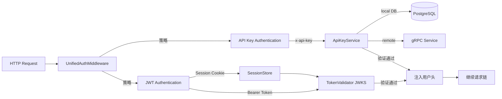
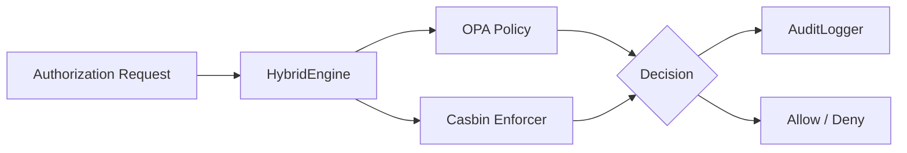
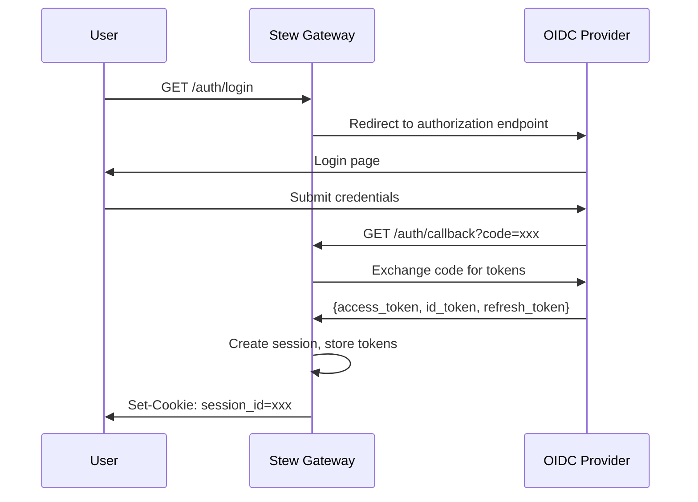

# 认证与授权

> 返回 [README](../README.zh-CN.md) | 参阅 [中间件](中间件.md)

---

## 概述

Stew 提供完整的认证（AuthN）与授权（AuthZ）能力，基于外部 `rustauth` 子仓库实现：

- **认证（AuthN）**：OIDC/JWT + API Key 双模式
- **授权（AuthZ）**：OPA + Casbin 混合决策引擎
- 所有认证/授权服务注册为**本地服务**，零网络开销

---

## 认证架构



---

## JWT 认证

### 工作流程

1. 检查请求是否需要认证（protobuf 选项 / 路径白名单）
2. 提取 Token：
   - **Session Cookie**：从 Cookie 获取 session_id -> SessionStore 查找 access_token
   - **Bearer Token**：从 `Authorization: Bearer <token>` 头提取
3. 使用 OIDC Provider 的 JWKS 验证 Token 签名
4. 验证 Token 有效期、audience 等 claims
5. 将用户信息注入请求头

### 配置

```bash
# 环境变量
export OIDC_CLIENT_ID=your-client-id
export OIDC_CLIENT_SECRET=your-client-secret
export OIDC_ISSUER_URL=https://your-oidc-provider.com
export OIDC_REDIRECT_URL=http://localhost:3012/auth/callback
```

```yaml
# YAML 配置
oidc:
  enabled: true
  client_id: "your-client-id"
  client_secret: "your-client-secret"
  issuer_url: "https://your-oidc-provider.com"
  redirect_url: "http://localhost:3012/auth/callback"
  scopes:
    - "openid"
    - "profile"
    - "email"
```

### 注入的用户信息头

验证通过后，以下头可在下游服务中使用：

| Header | 说明 |
|--------|------|
| `x-user-id` | 用户唯一标识 |
| `x-user-email` | 用户邮箱 |
| `x-user-name` | 用户名称 |
| `x-auth-type` | 认证方式（jwt/api_key） |

---

## API Key 认证

### 工作原理

1. 从请求头提取 API Key（默认头：`x-api-key`）
2. 通过 RustAuth 验证：
   - **本地验证**：查询 PostgreSQL 数据库（需配置 `DATABASE_URL`）
   - **远程验证**：通过 gRPC 调用验证服务
3. 验证通过后注入用户信息头

### 配置

```yaml
api_key:
  enabled: true
  header_name: "x-api-key"
  validation_mode: "local"      # local | grpc_only
  skip_paths:
    - "/health"
    - "/metrics"
    - "/_openapi"
```

### 前置条件

- 本地验证模式需要 PostgreSQL：`DATABASE_URL=postgresql://...`
- 远程验证模式需要可用的 API Key gRPC 服务

---

## 认证策略

通过 `AUTH_STRATEGY` 环境变量或配置文件设置：

| 策略 | 说明 | 行为 |
|------|------|------|
| `jwt_first` (默认) | JWT 优先 | 先 JWT，失败再 API Key |
| `api_key_first` | API Key 优先 | 先 API Key，失败再 JWT |
| `jwt_only` | 仅 JWT | 只尝试 JWT |
| `api_key_only` | 仅 API Key | 只尝试 API Key |
| `either` | 任一通过 | JWT 或 API Key 任一成功即可 |

---

## Protobuf 认证选项

可在 proto 定义中控制服务/方法级别的认证行为：

```protobuf
import "stew/api/v1/options.proto";

service MyService {
  option (stew.api.v1.service_auth) = {
    auth_required: true
  };

  // 此方法不需要认证
  rpc PublicMethod(Request) returns (Response) {
    option (stew.api.v1.method_auth) = {
      auth_required: false
    };
  }

  // 此方法继承服务级别设置（需要认证）
  rpc ProtectedMethod(Request) returns (Response) {}
}
```

### 判断逻辑

1. 检查路径是否在白名单中（`skip_paths`）
2. 检查方法级别 `method_auth` 选项
3. 如果方法无选项，检查服务级别 `service_auth` 选项
4. 如果服务也无选项，默认不需要认证

---

## 授权（OPA + Casbin）

### 混合授权引擎

Stew 使用 OPA 和 Casbin 的混合授权方案：



### OPA (Open Policy Agent)

- 基于 Rego 策略语言的通用策略引擎
- 通过 HTTP 与 OPA 服务通信
- 适合复杂的、细粒度的授权逻辑

### Casbin

- 基于 PERM 模型的授权框架
- 支持 ACL / RBAC / ABAC 等多种模型
- 策略通过 CSV 或数据库配置

### 配置

Casbin 模型文件（`config/casbin_model.conf`）：
```ini
[request_definition]
r = sub, obj, act

[policy_definition]
p = sub, obj, act

[role_definition]
g = _, _

[policy_effect]
e = some(where (p.eft == allow))

[matchers]
m = g(r.sub, p.sub) && r.obj == p.obj && r.act == p.act
```

Casbin 策略文件（`config/casbin_policy.csv`）：
```csv
p, admin, /api/v1/users, GET
p, admin, /api/v1/users, POST
p, user, /api/v1/users, GET
g, alice, admin
g, bob, user
```

### 初始化流程

1. 创建 OPA 客户端（连接 OPA 服务）
2. 创建 Casbin 执行器（加载模型和策略）
3. 创建混合决策引擎（编排两者）
4. 创建审计日志记录器
5. 创建策略同步器（定期同步策略更新）
6. 将授权服务注册为本地服务

---

## OIDC 认证流程

### 标准 Authorization Code Flow



### 本地服务接口

认证相关的本地服务（零网络开销）：

| 服务 | 方法 | 说明 |
|------|------|------|
| `stew.api.v1.AuthService` | `Login` | OIDC 登录跳转 |
| `stew.api.v1.AuthService` | `Callback` | 处理 OIDC 回调 |
| `stew.api.v1.AuthService` | `Logout` | 注销登录 |
| `stew.api.v1.AuthService` | `RefreshToken` | 刷新 Token |
| `stew.api.v1.UserService` | `GetUserInfo` | 获取用户信息 |
| `stew.api.v1.UserService` | `GetUserProfile` | 获取用户 Profile |

---

## Session 存储

支持两种 Session 存储后端：

| 后端 | 适用场景 | 说明 |
|------|----------|------|
| `MemorySessionStore` | 开发/单实例 | 进程内存储，重启丢失 |
| `RedisSessionStore` | 生产/多实例 | Redis 存储，支持分布式 |

Session 数据结构：
```rust
pub struct SessionData {
    pub user_id: String,
    pub access_token: String,
    pub refresh_token: Option<String>,
    pub id_token: Option<String>,
    pub expires_at: DateTime<Utc>,
    pub user_info: Option<UserInfo>,
}
```

---

## 安全建议

1. **生产环境必须启用 TLS** -- 保护 Token 传输安全
2. **使用 HTTPS 回调 URL** -- OIDC redirect_url 应使用 https
3. **妥善保管 Client Secret** -- 使用环境变量，不要写入代码或配置文件
4. **定期轮转 API Key** -- 设置合理的有效期
5. **gRPC Metadata 白名单** -- 避免透传 Authorization 等敏感头到不信任的后端
6. **启用审计日志** -- 记录认证/授权事件，便于追踪
