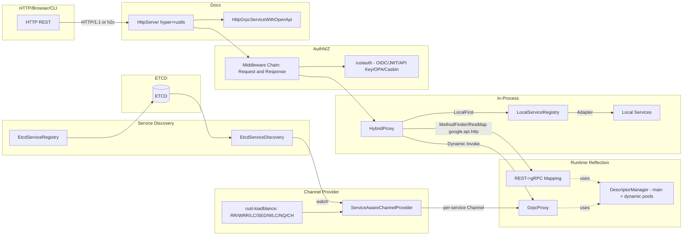
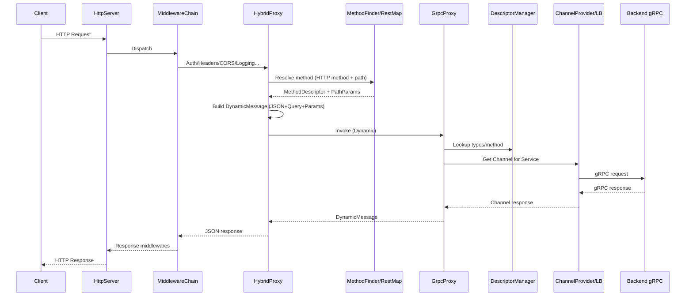
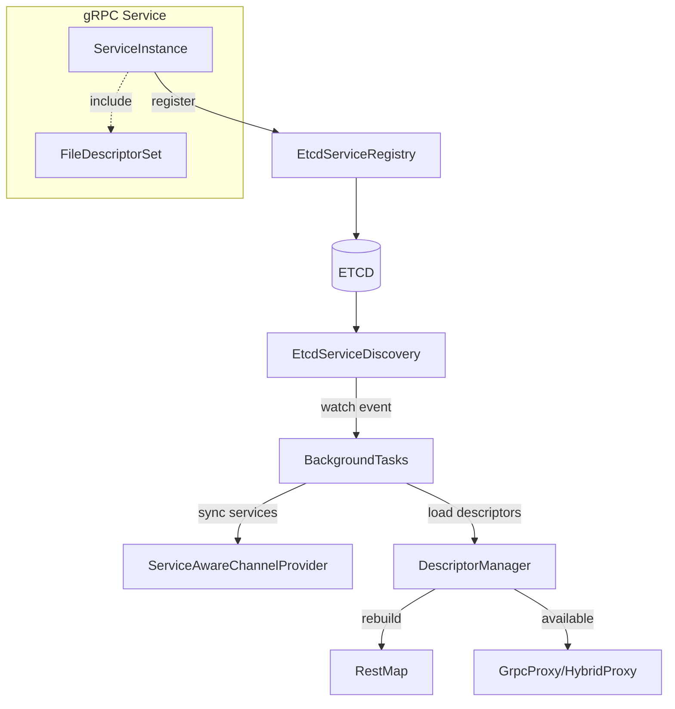

# 项目架构

> 返回 [README](../README.zh-CN.md)

---

## 架构总览

Stew 是一个高性能的 gRPC/HTTP 混合网关，核心设计目标：

1. 以 Protobuf 反射为核心（运行时加载 `FileDescriptorSet`），零静态代码生成
2. 通过 `google.api.http` 将 REST 请求动态映射到 gRPC 方法
3. 采用"本地优先、远程回退"的混合代理策略
4. 基于 ETCD 完成服务注册、发现与热加载
5. 按"服务名"进行后端通道选择与负载均衡
6. 提供统一中间件链与运行时 OpenAPI 文档

主要技术栈：Rust 2021、Hyper、Tonic、prost-reflect、Tokio、etcd-client、tracing、rustls。

---

## 架构图

---

## 核心组件

### 1. HttpServer（入口层）

- 源码：`src/server/http_server.rs`、`src/server/tls.rs`
- 基于 Hyper 1.x + Tokio 的 TCP 服务器
- 支持 HTTP/1.1、h2c 和 TLS HTTPS（rustls）
- 每个连接 spawn 独立 task 处理
- 支持可选的 mTLS（双向证书认证）

### 2. OpenAPI 适配层

- 源码：`src/openapi/adapter.rs`
- `HttpGrpcServiceWithOpenApi` 拦截 `/_openapi` 前缀请求
- 路由给 OpenAPI 服务；其余请求透传到核心代理

### 3. 中间件链（Middleware Chain）

- 源码：`src/core/middleware_interface.rs`、`src/middleware/*`
- 请求中间件：按注册顺序依次执行（RequestId -> Auth -> HttpToGrpc -> Logging）
- 响应中间件：按反向顺序执行（GrpcMetadata -> RequestId -> CORS -> Wrapper -> Redirect）
- 支持任意中间件在链中 short-circuit（认证失败直接返回）

### 4. HybridProxy（混合代理）

- 源码：`src/core/hybrid_proxy.rs`
- 三种路由策略：`LocalFirst` / `LocalOnly` / `RemoteOnly`
- LocalFirst：本地已注册则先走本地；仅"网络类错误"回退远程
- 业务错误（InvalidArgument/NotFound/Unauthenticated 等）直接返回，不回退
- 流式请求不做远程回退（显式禁止）

### 5. MethodFinder + RestMap（路由映射）

- 源码：`src/core/proxy_common.rs`、`src/core/rest_mapper.rs`
- 从 `google.api.http` 注解构建 REST 路由表
- 支持精确匹配和正则匹配（路径参数）
- 支持 `additional_bindings` 多路由绑定
- 多 DescriptorPool 聚合查找

### 6. GrpcProxy（远程代理）

- 源码：`src/core/proxy.rs`
- 支持 Unary / Server Streaming / Client Streaming / Bidi Streaming
- 动态 DynamicMessage 编解码
- 与 ChannelProvider/LB 协作选择后端

### 7. DescriptorManager（描述符管理）

- 源码：`src/core/descriptor_manager.rs`
- 管理主 pool + 多个动态 pools
- 查找模式：`MainOnly` / `DynamicFirst` / `DynamicOnly`
- 支持运行时动态添加服务描述符（通过 ETCD 传播）
- 描述符上传经过 5 级验证管道（大小、格式、服务名匹配、SHA-256 去重、兼容性检测）
- 版本化存储在 ETCD 中，支持回滚至历史版本
- 源码（验证）：`src/discovery/descriptor_validator.rs`
- 源码（回滚）：`src/discovery/rollback.rs`

### 8. ServiceAwareChannelProvider（通道管理）

- 源码：`src/core/service_aware_channel_provider.rs`
- 按 gRPC 服务全名路由到对应端点集群
- 精确匹配 -> 包前缀匹配 -> 默认 Channel
- 支持同步更新、重载、列出端点

### 9. LocalServiceRegistry（本地注册表）

- 源码：`src/core/local_service.rs`
- 存储进程内服务适配器
- 支持 Unary / Server Streaming / Client Streaming / Bidi Streaming
- 进程内直接调用，无网络开销

---

## 请求处理流程

### REST -> gRPC Unary 请求

### 详细流程

1. `HttpServer` 接收 HTTP 请求 -> `HttpGrpcServiceWithOpenApi` 判断是否 OpenAPI 请求
2. 非 OpenAPI 请求进入中间件链（RequestId/Auth/CORS/Logging/HttpToGrpc）
3. `HybridProxy` 将 HTTP 方法字符串转为内部 `HttpMethod`
4. `MethodFinder.find_method_with_http_method` 基于 `RestMap` 匹配 gRPC 方法
5. `HttpRequestParser` 解析 JSON Body 与 Query 参数
6. `HttpRequestParser::build_dynamic_message` 按 Protobuf 字段类型注入参数：
   - 支持 bool / int / float / enum / string / bytes / message / repeated / base64
   - 路径参数通过 `PathParamInjector` 注入到 DynamicMessage
7. HTTP headers 透传至 gRPC Metadata（过滤 host/content-type），设入 task-local 上下文
8. 路由策略决策：LocalFirst -> 先查本地注册表；本地失败按错误类型决定是否回退远程
9. 远程调用：ChannelProvider 按服务名获取 Channel -> gRPC 调用 -> 响应解码
10. 返回 JSON 文本（`utils::dynamic_to_json`），经响应中间件链处理后返回

### gRPC Streaming 请求

- 统一入口 `GrpcProxyTrait::handle_grpc_stream`
- `StreamConverter` 将 HTTP Body 帧流 -> gRPC 帧 -> `DynamicMessage` 流
- 本地服务策略允许则走本地流；流式请求失败不自动回退远程

---

## 路由策略与回退规则

| 策略 | 行为 |
|------|------|
| `LocalFirst` | 本地已注册则先走本地；仅 Unavailable/DeadlineExceeded/Cancelled 等网络类错误回退远程 |
| `LocalOnly` | 只走本地，不尝试远程 |
| `RemoteOnly` | 只走远程，不尝试本地 |

**网络类错误判断条件**（回退远程）：
- gRPC Status: Unavailable / DeadlineExceeded / Cancelled
- Unknown 且错误消息包含 connection / network / timeout / refused

**不回退的情况**：
- 业务类错误（InvalidArgument / NotFound / Unauthenticated / PermissionDenied 等）
- 流式请求（语义复杂，显式禁止回退）

---

## 服务发现与热加载数据流

1. 服务实例注册到 ETCD（可携带 `FileDescriptorSet`）
2. `EtcdServiceDiscovery` watch 变更事件
3. `BackgroundTaskManager` 收到变更后：
   - 将服务列表同步给 `ServiceAwareChannelProvider`（创建/更新 LB Channel）
   - 加载含有 `protobuf_descriptor` 的实例描述符到 `DescriptorManager`
   - 调用 `HybridProxy.reload_routes_from_pools()` 重建 RestMap 和 MethodFinder
4. 描述符版本化管理：
   - 每次上传经过 5 级验证管道（大小/格式/服务名/去重/兼容性）
   - 版本化存储在 ETCD（`/descriptors/{service}/active` + `/descriptors/{service}/v/{ver}/`）
   - 后台每 5 分钟清理超出保留数（默认 5 个）的旧版本

---

## 应用启动顺序

`StewApplication::initialize()` 按以下顺序装配：

1. **初始化日志** -- tracing-subscriber，DEV 模式开启文件/行号
2. **DescriptorManager** -- 加载核心服务描述符（auth/authz/apikey/discovery）
3. **LocalServiceRegistry** -- 创建空的本地注册表
4. **认证初始化** -- rustauth OIDC/JWT，可选 Session 与 DB
5. **授权初始化** -- OPA + Casbin 混合引擎
6. **代理配置** -- 创建 ServiceAwareChannelProvider + HybridProxy
7. **服务发现** -- ETCD 客户端、路由冲突检测、健康检查、路由重载回调
8. **中间件链** -- 请求中间件 + 响应中间件组装
9. **后台任务** -- ETCD 监听、状态输出、gRPC 后端重连

---

## 中间件链结构

---

## 边界与注意事项

- 流式请求不做远程回退（语义复杂，已显式禁止），需保证本地流处理的可用性
- 若描述符缺少 `google.api.http` 扩展，REST 路由不会生成（日志会提示）
- 无默认 Channel 时，未专门注册的服务会失败；建议配置默认后端或显式服务端点
- gRPC Metadata 透传建议采用白名单策略，避免透传敏感头
